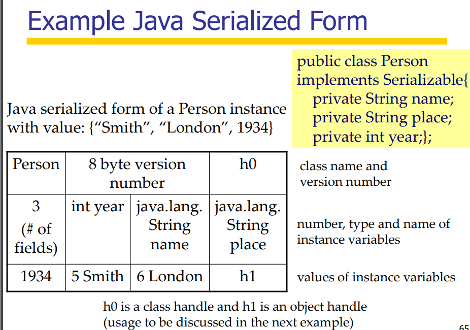

# Lec1

evaluation

* quizzes -- 60%
  * quiz1: week8 (TBC)
  * quiz2: week 11
* course project: 40%
  * team-based -- 4
  * release in week 3
  * project demo in week 11
* **week 11**: second quiz and team presentation

## Distributed System

### Definition

* a set of networked computers
* communicate by passing messages

### Fundamental Characteristics

* concurrency: concurrent program execution
  * higher capacity
  * need to coordinate concurrently executing works
* loosely coupled
  * no global clock --> difficult to synchronize
  * no global shared memory --> instead, interact by passing messages
* independent failures
  * ds makes it more fault-tolerant than stand-alone systems 
  * for example: servers -- if one server down, others still can process the requests

### Distributed Services

the resources are managed and provided by **Services**

the server provides, the client uses

### Challenges of DS

Heterogeneity - hardware and software components

* networks -- different networks communicate with each other using the protocols
* hardware -- different programs may have different way of processing data, like big-endian and little-endian. How to exchange data between programs based on different hardware?
  * Operation Systems
    * the interfaces of communication may differ between different OSs
  * Programming languages
    * the representations for the same thing may differ between different languages

### Layers in DS

* platform --> hardware and OS
* middleware --> software layer to provide services to applications

### Models

* architectural model
  * client-server: the server manages and provides, the client uses
  * peer-to-peer: all like one, cooperate with their peers to compute
* fundamental models
  * interaction model:
    * synchronous DS: assume upper/lower bounds on
    * asynchronous DS: assume no bounds on, no timeout for communications but need to reply after receiving messages
  * failure model:
    * 两军交战问题证明：假设两军的交互过程有限，且两军最后达成共识。考虑最后一条消息m，m由A发向B，既然m是最后一条消息，那么A的决策和m的成功与失败无关；对B来说，B和A需要做一样的决策，所以m的成功与失败也不重要，因此m是多余的，所以矛盾。

### Marshalling and Unmarshalling

#### CORBA's Common Data Representation

common object request broker architecture(middleware)

CORBA has 15 primitive types

before transmission, big/little-endian will be confirmed and the recipient translates if necessary

* the data will be **padded** on word boundary
* In CDR form, the type of data are **not** given
* It is assumed that the sender and the recipient have **common knowledge** of the order and types of the data items in a message

#### Java's Object Serialization

for java use only, both objects and primitives data values may be passed as arguments and the results of method invocations

Different with CDR, JOS has **no prior knowledge** of the serialized form. So the serialized form should include some information about the class of the object

class name + version number + h0 + fields(int, String, String) + values of variables + h1